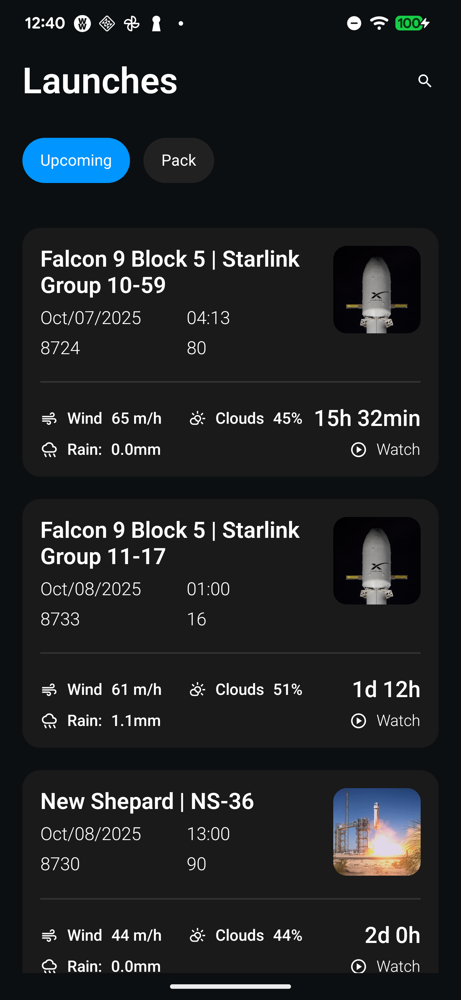

# SpaceX Launch

A modern Android application built with Jetpack Compose that displays SpaceX launch information with offline-first architecture.

## Screenshots

| Home Screen | Launch Details |
|-------------|----------------|
|  |  |

## Features

- **Launch List**: Browse upcoming and past SpaceX launches
- **Offline Support**: View cached launch data without internet connection
- **Modern UI**: Built with Jetpack Compose and Material 3
- **Clean Architecture**: Modular design with feature-based modules
- **Real-time Data**: Fetches live launch data from [The Space Devs API](https://ll.thespacedevs.com/2.3.0/)

## Tech Stack

- **UI**: Jetpack Compose, Material 3
- **Architecture**: MVVM with MVI pattern
- **Dependency Injection**: Hilt
- **Networking**: Retrofit, OkHttp
- **Database**: Room with Paging 3
- **Image Loading**: Coil
- **Serialization**: Kotlinx Serialization
- **Testing**: JUnit, MockK, Turbine

## Requirements

- Android Studio Hedgehog (2023.1.1) or later
- JDK 21
- Android SDK 24+ (Android 7.0)
- Target SDK 36

## Dependencies

### Core Libraries
- **Jetpack Compose BOM**: 2025.09.01
- **Hilt**: 2.57.2
- **Retrofit**: 3.0.0
- **Room**: 2.8.1
- **Paging**: 3.3.6
- **Coil**: 3.3.0

### Development Tools
- **Kotlin**: 2.2.20
- **KSP**: 2.2.20-2.0.3
- **Ktlint**: 1.7.1
- **Jacoco**: Code coverage reporting

## Getting Started

1. **Clone the repository**
   ```bash
   git clone https://github.com/yourusername/spacex-launch.git
   cd spacex-launch
   ```

2. **Open in Android Studio**
   - Launch Android Studio
   - Open the project folder
   - Wait for Gradle sync to complete

3. **Run the app**
   ```bash
   ./gradlew assembleDebug
   ```
   Or use Android Studio's Run button (▶️)

4. **Run tests**
   ```bash
   ./gradlew test
   ```

## Project Structure

```
├── app/                    # Main application module
├── core/
│   ├── database/          # Room database and entities
│   ├── design-system/     # UI components and themes
│   ├── mvi/              # MVI architecture base classes
│   ├── network/          # Retrofit API services
│   └── tools/            # Utility classes
└── feature/
    └── home/             # Home feature module
```

## API Data Source

This app consumes data from [The Space Devs API v2.3.0](https://ll.thespacedevs.com/2.3.0/) to fetch:
- Upcoming launches: `/launches/upcoming/`
- Previous launches: `/launches/previous/`
- Launch details, rocket information, and launchpad data

## License

This project is licensed under the Apache License, Version 2.0 - see the [LICENSE](LICENSE) file for details.
